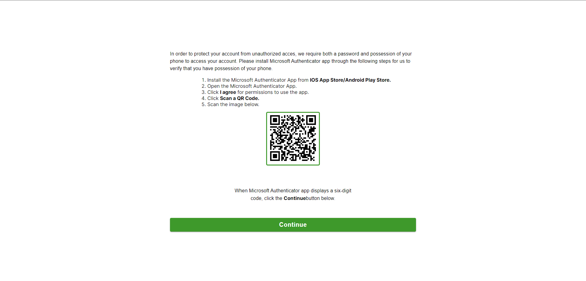
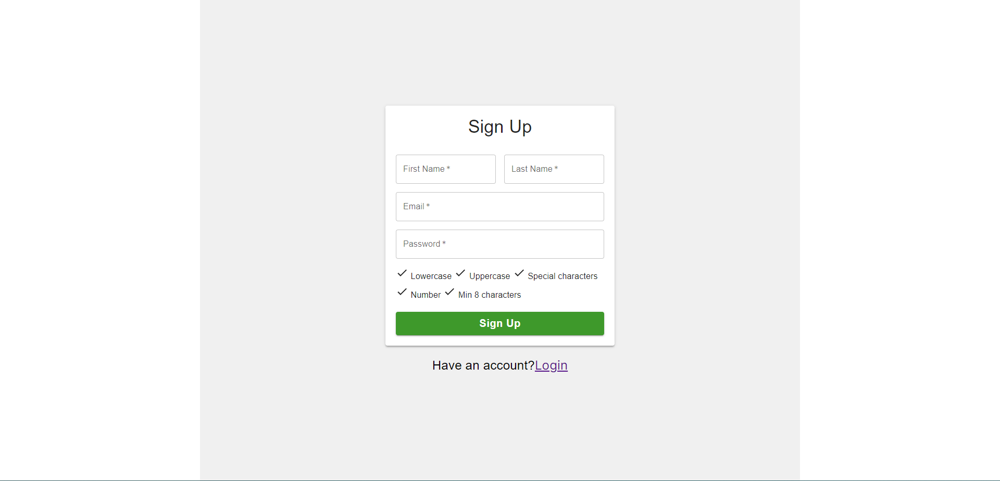

# SecurAuth-Pro

## Description
SecurAuth Pro is a two-factor authentication (2FA) application consisting of a backend and a frontend. The backend provides user creation and confirmation functionality, as well as 2FA authentication via QR codes. The frontend provides an intuitive user interface to enhance the end-user experience.

## Key Features
- User registration with email confirmation.
- Two-factor authentication via QR codes.
- User-friendly interface.
- Secure and reliable.

## Screenshots


*Screenshot of the 2-factor authenticator*


*Screenshot of the Sign-In Page*

## Installation

  ### 1. Clone the Repository: ``` git clone https://github.com/Marigiko/SecurAuth-Pro.git ```

  ### 2. Create a MySQL database with the name of your choice.

  ### 3. Navigate to the Backend: ``` cd BackEnd-main ```

  ### 4. Create a .env file and enter the following:
        ``` DB_USER=YOUR_USERNAME
            DB_PASSWORD=YOUR_PASSWORD
            DB_NAME=YOUR_DB_NAME
            DB_HOST=YOUR_HOST
            EMAIL_USER=YOUR_GOOGLE_MAIL
            EMAIL_PASS=YOUR_GOOGLE_MAIL_PASSWORD (you need to generate this in your Google account, learn more here => https://support.google.com/mail/answer/185833) ```

  ### 5. Install Dependencies: ``` npm install ```

  ### 6. Run the Backend: ``` npm run start ```

  ### 7. Navigate to the Frontend: ``` cd FrontEnd-main ```

  ### 8. Install Dependencies: ``` npm install ```

  ### 9. Run the Frontend: ``` npm start ```

## Technologies Used
- Javascript
- React
- NodeJS
- Passport
- Sequelize
- bcryptjs
- Express
- Nodemailer
- Authenticator
- Redux
- Axios

## Contribution
We welcome any contributions to this project. If you wish to contribute, follow these steps:

1. Fork the repository.
2. Create a new branch for your contribution: `git checkout -b your-contribution-branch`
3. Make your changes and improvements in the branch.
4. Commit your changes: `git commit -m "Description of your changes"`
5. Push your branch: `git push origin your-contribution-branch`
6. Create a pull request on GitHub explaining your changes and why they should be included.
7. Wait for us to review and approve your pull request.

Thank you for your contribution!

## License
This project is distributed under the MIT License. You can find more details in the [LICENSE](LICENSE) file.

## Contact
If you have questions, suggestions, or encounter any issues, please don't hesitate to get in touch with us. You can open an issue in this repository or send us an email at [marioauinojob@gmail.com](mailto:marioaquinojob@email.com).

---

We hope you find this README template useful for your "SecurAuth Pro" project! Be sure to customize it to your project's specific needs and keep it updated as you make changes and improvements to your application.
